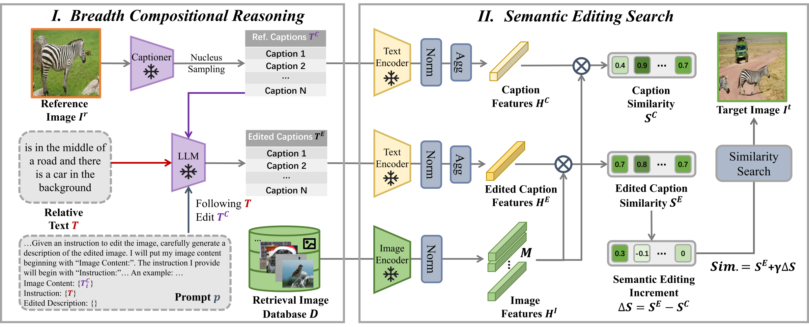

# SEIZE (ACM MM 2024)

### SEIZE: Semantic Editing Increment Benefits Zero-Shot Composed Image Retrieval
[](https://paperswithcode.com/sota/zero-shot-composed-image-retrieval-zs-cir-on-1?p=semantic-editing-increment-benefits-zero-shot)
[](https://paperswithcode.com/sota/zero-shot-composed-image-retrieval-zs-cir-on?p=semantic-editing-increment-benefits-zero-shot)
[](https://paperswithcode.com/sota/zero-shot-composed-image-retrieval-zs-cir-on-2?p=semantic-editing-increment-benefits-zero-shot)

This is the **code  repository** of the paper "***SEIZE**: **S**emantic **E**diting **I**ncrement Benefits **ZE**ro-Shot Composed Image Retrieval*". [**[Paper]**](https://dl.acm.org/doi/pdf/10.1145/3664647.3681649) based on our previous work "***LDRE**: **L**LM-based **D**ivergent **R**easoning and **E**nsemble for Zero-Shot Composed Image Retrieval*". [**[Paper]**](https://dl.acm.org/doi/pdf/10.1145/3626772.3657740) [**[GitHub]**](https://github.com/yzy-bupt/LDRE)

## Overview



### Abstract

Zero-Shot Composed Image Retrieval (ZS-CIR) has attracted more attention in recent years, focusing on retrieving a specific image based on a query composed of a reference image and a relative text without training samples. Specifically, the relative text describes the differences between the two images. Prevailing ZS-CIR methods employ image-to-text (I2T) models to convert the query image into a single caption, which is further merged with the relative text by text-fusion approaches to form a composed text for retrieval. However, these methods neglect the fact that ZS-CIR entails considering not only the final similarity between the composed text and retrieved images but also the semantic increment during the compositional editing process. To address this limitation, this paper proposes a training-free method called Semantic Editing Increment for ZS-CIR (SEIZE) to retrieve the target image based on the query image and text without training. Firstly, we employ a pre-trained captioning model to generate diverse captions for the reference image and prompt Large Language Models (LLMs) to perform breadth compositional reasoning based on these captions and relative text, thereby covering the potential semantics of the target image. Then, we design a semantic editing search to incorporate the semantic editing increment contributed by the relative text into the retrieval process. Concretely, we comprehensively consider relative semantic increment and absolute similarity as the final retrieval score, which is subsequently utilized to retrieve the target image in the CLIP feature space. Extensive experiments on three public datasets demonstrate that our proposed SEIZE achieves the new state-of-the-art performance. The code is publicly available at https://github.com/yzy-bupt/SEIZE.

## Getting Started

We recommend using the [**Anaconda**](https://www.anaconda.com/) package manager to avoid dependency/reproducibility problems.
For Linux systems, you can find a conda installation guide [here](https://docs.conda.io/projects/conda/en/latest/user-guide/install/linux.html).

### Installation

1. Clone the repository, click  `Download file`

2. Install Python dependencies

```sh
conda create -n SEIZE -y python=3.8.18
conda activate SEIZE
conda install -y -c pytorch pytorch=1.11.0 torchvision=0.12.0
pip install transformers==4.26.1 tqdm==4.66.1 openai==0.28 salesforce-lavis==1.0.2 open_clip_torch==2.24.0
pip install git+https://github.com/openai/CLIP.git
```

### Data Preparation

#### CIRCO

Download the CIRCO dataset following the instructions in the [**official repository**](https://github.com/miccunifi/CIRCO).

After downloading the dataset, ensure that the folder structure matches the following:

```
├── CIRCO
│   ├── annotations
|   |   ├── [val | test].json

│   ├── COCO2017_unlabeled
|   |   ├── annotations
|   |   |   ├──  image_info_unlabeled2017.json
|   |   ├── unlabeled2017
|   |   |   ├── [000000243611.jpg | 000000535009.jpg | ...]
```

#### CIRR

Download the CIRR dataset following the instructions in the [**official repository**](https://github.com/Cuberick-Orion/CIRR).

After downloading the dataset, ensure that the folder structure matches the following:

```
├── CIRR
│   ├── train
|   |   ├── [0 | 1 | 2 | ...]
|   |   |   ├── [train-10108-0-img0.png | train-10108-0-img1.png | ...]

│   ├── dev
|   |   ├── [dev-0-0-img0.png | dev-0-0-img1.png | ...]

│   ├── test1
|   |   ├── [test1-0-0-img0.png | test1-0-0-img1.png | ...]

│   ├── cirr
|   |   ├── captions
|   |   |   ├── cap.rc2.[train | val | test1].json
|   |   ├── image_splits
|   |   |   ├── split.rc2.[train | val | test1].json
```

#### FashionIQ

Download the FashionIQ dataset following the instructions in the [**official repository**](https://github.com/XiaoxiaoGuo/fashion-iq).

After downloading the dataset, ensure that the folder structure matches the following:

```
├── FashionIQ
│   ├── captions
|   |   ├── cap.dress.[train | val | test].json
|   |   ├── cap.toptee.[train | val | test].json
|   |   ├── cap.shirt.[train | val | test].json

│   ├── image_splits
|   |   ├── split.dress.[train | val | test].json
|   |   ├── split.toptee.[train | val | test].json
|   |   ├── split.shirt.[train | val | test].json

│   ├── images
|   |   ├── [B00006M009.jpg | B00006M00B.jpg | B00006M6IH.jpg | ...]
```

## SEIZE

This section provides instructions for reproducing the results of the SEIZE method.

### 1. Multi-caption Generator

We harness a pre-trained captioning model to generate diverse captions for the reference image focusing on different semantic perspectives. To ensure the generation of diverse captions and prevent repetition, we employ nucleus sampling during the captioning process, improving the diversity of the generated captions.

Run the following command to generate diverse captions:

```sh
python src/multi_caption generator_{circo/cirr/fashioniq}.py
```

### 2. LLM-based Editing Reasoner

Then, we prompt an LLM to infer breadth edited captions based on the relative text, describing possible composed images of diverse semantics.

Run the following command to reason and edit for combination:

```sh
python src/LLM-based_editing_reasoner_{circo/cirr/fashioniq}.py
```

### 3. Semantic Editing Search

We propose a semantic editing search to comprehensively consider both the increment of semantic editing and the final similarity. We separately calculate the cosine similarity between the composed text and the content text with the retrieval images. We compute the semantic editing increment as the difference in similarity or ranking, add it to the absolute similarity for the final adjusted score, and then retrieve the composed image based on this score in the CLIP feature space.

To generate the predictions file to be uploaded on the [CIRR Evaluation Server](https://cirr.cecs.anu.edu.au/) or on the [CIRCO Evaluation Server](https://circo.micc.unifi.it/) run the following command:

```sh
python src/semantic_editing_search.py
```

The predictions file will be saved in the `data/test_submissions/{dataset}/` folder.

We have provided the experimental results of our SEIZE for your evaluation on the [CIRR Evaluation Server](https://cirr.cecs.anu.edu.au/) or on the [CIRCO Evaluation Server](https://circo.micc.unifi.it/), in the `data/test_submissions/{dataset}/` folder, which have achieved state-of-the-art (SOTA) results as shown in the paper.

## Citation 
We hope you find our paper/code useful in your research and cite it as follows. Thanks!

```bibtex
@inproceedings{yang2024semantic,
  title={Semantic Editing Increment Benefits Zero-Shot Composed Image Retrieval},
  author={Yang, Zhenyu and Qian, Shengsheng and Xue, Dizhan and Wu, Jiahong and Yang, Fan and Dong, Weiming and Xu, Changsheng},
  booktitle={Proceedings of the 32nd ACM International Conference on Multimedia},
  pages={1245--1254},
  year={2024}
}
```

